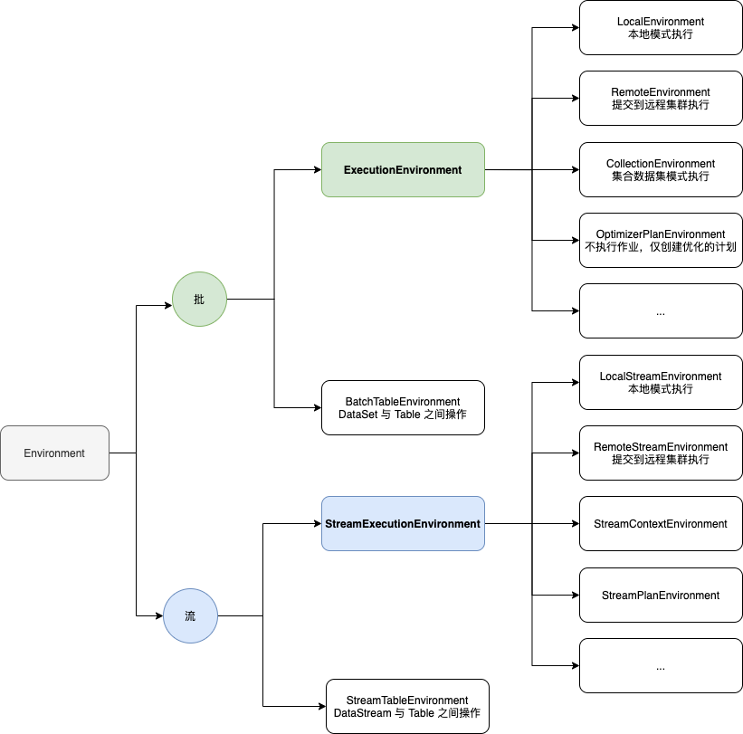

# Flink Environment


## 关系




## 获取方式

```java
import org.apache.flink.api.java.ExecutionEnvironment;
import org.apache.flink.streaming.api.environment.StreamExecutionEnvironment;
import org.apache.flink.table.api.bridge.java.BatchTableEnvironment;
import org.apache.flink.table.api.bridge.java.StreamTableEnvironment;

// DataSet
ExecutionEnvironment bEnv = ExecutionEnvironment.getExecutionEnvironment();
// DataSet Table
BatchTableEnvironment btEnv = BatchTableEnvironment.create(bEnv);

// DataStream
StreamExecutionEnvironment sEnv = StreamExecutionEnvironment.getExecutionEnvironment();
// DataStream Table
StreamTableEnvironment stEnv = StreamTableEnvironment.create(sEnv);
```


## Read More

- [Flink Environment 概览](https://blog.csdn.net/xiaohulunb/article/details/103030437)

